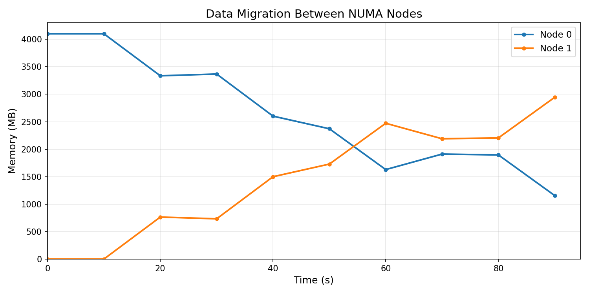
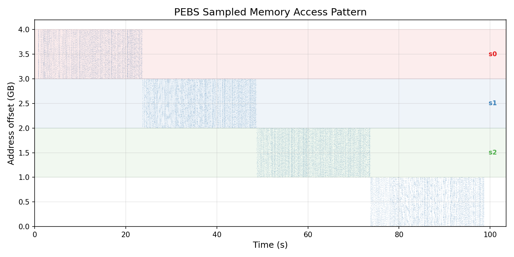
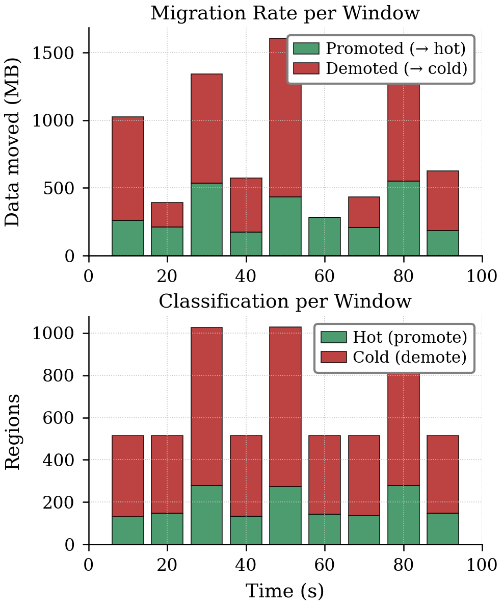

# TierScape: Two-Tier Memory Tiering Daemon

A lightweight userspace daemon that automatically tiers memory between two NUMA nodes (e.g., DRAM and CXL/Optane) using hardware performance counters (PEBS) for access profiling and `move_pages()` for migration.

## How It Works

```
tierscaped attaches to a running process (or launches one), profiles memory
access patterns via PEBS sampling, and periodically migrates pages between
a hot tier (fast NUMA node) and a cold tier (slow NUMA node) based on a
configurable percentile hotness threshold.
```

**Key features:**
- Single self-contained binary — no external scripts or solvers
- TOML config file with CLI overrides
- Percentile-based hot/cold classification
- Multi-threaded `move_pages()` migration
- Automatic sanity checks (NUMA nodes, perf, PMU events)
- Daemonizes by default; foreground mode for debugging

## Requirements

- Linux with 2+ NUMA nodes
- `perf` binary matching your kernel (with PEBS support)
- `libnuma-dev` (build dependency)
- `cmake >= 3.10`, `g++` with C++17 support
- Root access (for `move_pages()` and perf)

## Quick Start

### 1. Build

```bash
cd src
make
```

This produces `src/build/tierscaped`.

### 2. Configure

Copy and edit the example config:

```bash
cp tierscaped.toml.example tierscaped.toml
```

Edit `tierscaped.toml`:

```toml
[tiers]
hot_node = 0          # NUMA node for hot/fast tier
cold_node = 1         # NUMA node for cold/slow tier

[sampling]
# PEBS events (use `perf list` to find correct names for your CPU)
events = [
    "mem_inst_retired.all_loads:P",
    "mem_inst_retired.all_stores:P",
    "mem_inst_retired.stlb_miss_loads:P",
    "mem_inst_retired.stlb_miss_stores:P",
]
frequency = 10000       # sample period (perf -c flag)
window_seconds = 20     # profiling window duration (test driver uses 10 for faster feedback)

[classification]
hot_percentile = 25.0   # regions >= this percentile stay on hot node

[migration]
threads = 2
max_pages_per_window = 5000000
region_size = "2M"

[daemon]
pidfile = "/tmp/tierscaped.pid"
verbose = false
log_file = ""
perf_bin = "/usr/bin/perf"   # path to perf binary for your kernel
```

> **Note:** The `perf_bin` path must point to a perf binary that matches your running kernel. Use `perf --version` to verify.

### 3. Verify Your System

```bash
# Check NUMA topology
numactl --hardware

# Verify perf works
perf stat -e mem_inst_retired.all_loads -a -- sleep 0.1
```

### 4. Run

```bash
# Attach to an existing process
sudo src/build/tierscaped -c tierscaped.toml -p <PID>

# Or launch a process with tiering
sudo src/build/tierscaped -c tierscaped.toml -- ./my_workload --args

# Foreground + verbose (for debugging/testing)
sudo src/build/tierscaped -f -v -c tierscaped.toml -p <PID>
```

### 5. Stop

```bash
kill $(cat /tmp/tierscaped.pid)
```

## Testing with masim

`masim_mod/` contains a memory access simulator for validating tiering behavior.

### Build masim

```bash
cd masim_mod && make
```

### Run a Quick Test

The automated test script handles masim launch, daemon attachment, numastat logging,
PEBS sample dumping, and cleanup. Each run saves all artifacts in a timestamped directory.

```bash
# One command — runs masim (4GB stairs, 100s) + tierscaped (10s window)
bash masim_mod/run_eval.sh
```

This produces an experiment directory under `masim_mod/eval/exp-<YYYYMMDD_HHMMSS>/` containing:

| File | Description |
|------|-------------|
| `config.toml` | Daemon configuration used |
| `masim.log` | masim output (regions, phases) |
| `tierscaped.log` | Daemon log with per-window stats |
| `numastat.log` | Periodic NUMA memory snapshots |
| `samples.dump` | Raw PEBS samples (`time_ms addr`) |

### Generate Plots

```bash
# Generate migration + access pattern plots
python3 masim_mod/plotting/plot_migration.py --eval-dir masim_mod/eval/exp-<timestamp>

# Generate migration rate (promoted/demoted) plot
python3 masim_mod/plotting/plot_migration_rate.py --eval-dir masim_mod/eval/exp-<timestamp>
```

### Example Results

**NUMA Node Migration** — Memory moving from Node 0 (hot) to Node 1 (cold) over time:



**PEBS Access Pattern** — Real sampled addresses showing the stairs workload (each phase accesses a different 1GB region):



**Migration Rate** — Per-window breakdown of promoted (→ hot) vs demoted (→ cold) pages:



### Reproduce from Scratch

```bash
# 1. Build everything
cd masim_mod && make && cd ..
cd src/build && cmake .. -DCMAKE_BUILD_TYPE=Release && make -j$(nproc) && cd ../..

# 2. Run experiment (takes ~2 minutes)
bash masim_mod/run_eval.sh

# 3. Generate all plots
EXP=$(ls -td masim_mod/eval/exp-* | head -1)
python3 masim_mod/plotting/plot_migration.py --eval-dir "$EXP"
python3 masim_mod/plotting/plot_migration_rate.py --eval-dir "$EXP"

# 4. View results
ls "$EXP"/*.png
```

### masim Config

The default config (`masim_mod/configs/stairs_4gb_100s`) runs a staircase pattern:
4 regions × 1GB, 4 phases × 25s each, one region accessed per phase.

## CLI Reference

```
tierscaped [OPTIONS] -p <PID>
tierscaped [OPTIONS] -- <command> [args...]

OPTIONS:
  -p, --pid <PID>         Target process PID
  -c, --config <path>     TOML config file
  --hot-node <N>          NUMA node for hot tier
  --cold-node <N>         NUMA node for cold tier
  --hot-pct <float>       Hot percentile threshold (default: 25.0)
  --freq <int>            PEBS sampling period (default: 10000)
  --threads <int>         Migration threads (default: 2)
  --window <int>          Window size in seconds (default: 20)
  --region-size <sz>      Region size (default: 2M)
  --max-pages <int>       Max pages per window (default: 5000000)
  -v, --verbose           Verbose logging
  -f, --foreground        Don't daemonize
  --dry-run               Profile only, no migration
  --pidfile <path>        PID file (default: /tmp/tierscaped.pid)
  --perf <path>           Path to perf binary
  -h, --help              Show help
```

CLI arguments override config file values.

## Repository Structure

```
├── src/                       # Daemon source code
│   ├── main.cpp               # Entry point, CLI, daemonization
│   ├── config.cpp/.h          # TOML config parser
│   ├── sanity.cpp/.h          # Startup sanity checks
│   ├── sampler.cpp/.h         # PEBS pipeline (perf record | perf script)
│   ├── classifier.cpp/.h      # Percentile-based hot/cold classification
│   ├── migrator.cpp/.h        # Multi-threaded move_pages()
│   ├── region.cpp/.h          # Region management
│   ├── util.cpp/.h            # Logging, process utilities
│   ├── CMakeLists.txt         # Build system
│   └── Makefile               # Convenience wrapper
├── masim_mod/                 # Memory access simulator (test workload)
│   ├── masim.c                # Simulator source
│   ├── configs/               # Workload configs
│   └── Makefile
├── tierscaped.toml.example    # Example configuration
├── plan_two_tier_18_5_26.md   # Design document with test results
└── LICENSE
```

## Documentation

Detailed architecture & operations docs live in [docs/](docs/):

- [Architecture](docs/architecture.md) — components & data flow
- [Design](docs/design.md) — rationale for each design decision
- [Region management](docs/region-management.md)
- [Sampling](docs/sampling.md) (PEBS pipeline)
- [Classification](docs/classification.md)
- [Migration](docs/migration.md) (`move_pages`, VMA filtering)
- [Lifecycle](docs/lifecycle.md) (signals, daemonization)
- [Configuration](docs/configuration.md)
- [Testing](docs/testing.md)
- [Troubleshooting](docs/troubleshooting.md)

## License

See [LICENSE](LICENSE).

